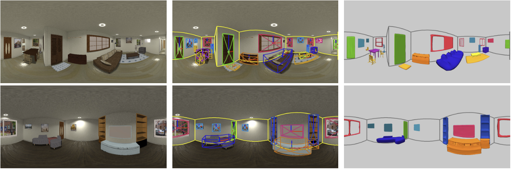

# DeepPanoContext (DPC) [[Project Page (with interactive results)]](https://chengzhag.github.io/publication/dpc/)[[Paper]](https://arxiv.org/abs/2108.10743)

### DeepPanoContext: Panoramic 3D Scene Understanding with Holistic Scene Context Graph and Relation-based Optimization
Cheng Zhang, Zhaopeng Cui, Cai Chen, Shuaicheng Liu, Bing Zeng, Hujun Bao, Yinda Zhang




## Introduction

This repo contains data generation, data preprocessing, training, testing, evaluation, visualization code of our ICCV 2021 paper.

## Install

Install necessary tools and create conda environment (needs to install anaconda if not available): 
```
sudo apt install xvfb ninja-build
conda env create -f environment.yaml
conda activate Pano3D
python -m pip install detectron2 -f https://dl.fbaipublicfiles.com/detectron2/wheels/cu101/torch1.7/index.html
python project.py build
```

Since the dataloader loads large number of variables,
before training, please follow [this](https://stackoverflow.com/questions/39537731/errno-24-too-many-open-files-but-i-am-not-opening-files) to raise the open file descriptor limits of your system.
For example, to permanently change the setting, edit ```/etc/security/limits.conf``` with a text editor and add the following lines:
```
*         hard    nofile      500000
*         soft    nofile      500000
root      hard    nofile      500000
root      soft    nofile      500000
```

## Demo

Download the [pretrained checkpoints](https://stduestceducn-my.sharepoint.com/:u:/g/personal/2015010912010_std_uestc_edu_cn/EUbGsq_V5K9Ai7U-MpMBcbsBEgPvl3VtVpsVv1IfJDlY7g?e=M5oz2u) 
of detector, layout estimation network, and other modules.
Then unzip the folder ```out``` into the root directory of current project.
Since the given checkpoints are trained with current version of our code, which is a refactored version, the results are slightly better than those reported in our paper.

Please run the following command to predict on the given example in ```demo/input``` with our full model:

```shell
CUDA_VISIBLE_DEVICES=0 WANDB_MODE=dryrun python main.py configs/pano3d_igibson.yaml --model.scene_gcn.relation_adjust True --mode test
```
    
Or run without relation optimization:

```shell
CUDA_VISIBLE_DEVICES=0 WANDB_MODE=dryrun python main.py configs/pano3d_igibson.yaml --mode test
```

The results will be saved to ```out/pano3d/<demo_id>```.
If nothing goes wrong, you should get the following results:

  <br>
 

## Data preparation

Our data is rendered with [iGibson](http://svl.stanford.edu/igibson/). 
Here, we follow their [Installation](http://svl.stanford.edu/igibson/docs/installation.html) guide to download iGibson dataset, then render and preprocess the data with our code.

1. Download iGibson dataset with:
    ```shell
    python -m gibson2.utils.assets_utils --download_assets
    python -m gibson2.utils.assets_utils --download_ig_dataset
    python -m gibson2.utils.assets_utils --download_ext_scene_assets
    ```

2. Render panorama with:
    ```shell
    python -m utils.render_igibson_scenes --renders 10 --random_yaw --random_obj --horizon_lo --world_lo
    ```
   The rendered dataset should be in ```data/igibson/```.
   
3. Make models watertight and render/crop single object image:
    ```shell
    python -m utils.preprocess_igibson_obj --skip_mgn
    ```
   The processed results should be in ```data/igibson_obj/```.
   
4. (Optional) Before proceeding to the training steps, you could visualize dataset ground-truth of ```data/igibson/``` with:
    ```shell
    python -m utils.visualize_igibson
    ```
   Results ('visual.png' and 'render.png') should be saved to folder of each camera like ```data/igibson/Pomaria_0_int/00007```.
   

## Training and Testing

Hint: In the steps bellow, when training or testing with main.py, you can override yaml configurations with command line parameter:
```shell
CUDA_VISIBLE_DEVICES=0 python main.py configs/layout_estimation_igibson.yaml --train.epochs 100
```
This might be helpful when debugging or tuning hyper-parameters.

### First Stage
 
#### 2D Detector

1. (Optional) Visualize 2D detection ground-truth with:
    ```shell
    python models/detector/dataset.py
    ```

2. Train 2D detector (Mask RCNN) with:
    ```shell
    CUDA_VISIBLE_DEVICES=0 python train_detector.py
    ```
   The trained weights will be saved to ```out/detector/detector_mask_rcnn```
      
3. (Optional) When training 2D detector, you could visualize the training process with:
    ```shell
    tensorboard --logdir out/detector/detector_mask_rcnn --bind_all --port 6006
    ```

4. (Optional) Evaluate with:
    ```shell
    CUDA_VISIBLE_DEVICES=0 python test_detector.py
    ```
   The results will be saved to ```out/detector/detector_mask_rcnn/evaluation_{train/test}```.
   Alternatively, you can visualize the prediction results on test set with:
   ```shell
    CUDA_VISIBLE_DEVICES=0 python test_detector.py --visualize --split test
    ```
   The visualization will be saved to the folder where the model weights file is.
   
5. Visualize BFoV detection results:
    ```shell
    CUDA_VISIBLE_DEVICES=0 python configs/detector_2d_igibson.yaml --mode qtest --log.vis_step 1
    ```
   The visualization will be saved to ```out/detector/<detector_test_id>```

#### Layout Estimation

Train layout estimation network (HorizonNet) with:
```shell
CUDA_VISIBLE_DEVICES=0 python main.py configs/layout_estimation_igibson.yaml
```
The checkpoint and visualization results will be saved to ```out/layout_estimation/<layout_estimation_id>/model_best.pth```
   
#### Save First Stage Outputs

1. Save predictions of 2D detector and LEN as dateset for stage 2 training:
    ```shell
    CUDA_VISIBLE_DEVICES=0 WANDB_MODE=dryrun python main.py configs/first_stage_igibson.yaml --mode qtest --weight out/layout_estimation/<layout_estimation_id>/model_best.pth
    ```
   The first stage outputs should be saved to ```data/igibson_stage1```
   
2. (Optional) Visualize stage 1 dataset with:
    ```shell
    python -m utils.visualize_igibson --dataset data/igibson_stage1 --skip_render
    ```

### Second Stage

#### Object Reconstruction

Train object reconstruction network (LIEN+LDIF) with:
```shell
CUDA_VISIBLE_DEVICES=0 python main.py configs/ldif_igibson.yaml
```
The checkpoint and visualization results will be saved to ```out/ldif/<ldif_id>```.
   
#### Bdb3D Estimation

Train bdb3d estimation network (BEN) with:
```shell
CUDA_VISIBLE_DEVICES=0 python main.py configs/bdb3d_estimation_igibson.yaml
```
The checkpoint and visualization results will be saved to ```out/bdb3d_estimation/<bdb3d_estimation_id>```.

#### Relation SGCN
   
1. Train Relation SGCN without relation branch:
    ```shell
    CUDA_VISIBLE_DEVICES=0 python main.py configs/relation_scene_gcn_igibson.yaml --model.scene_gcn.output_relation False --model.scene_gcn.loss BaseLoss --weight out/bdb3d_estimation/<bdb3d_estimation_id>/model_best.pth out/ldif/<ldif_id>/model_best.pth
    ```
   The checkpoint and visualization results will be saved to ```out/relation_scene_gcn/<relation_sgcn_wo_rel_id>```.
   
2. Train Relation SGCN with relation branch:
    ```shell
    CUDA_VISIBLE_DEVICES=0 python main.py configs/relation_scene_gcn_igibson.yaml --weight out/relation_scene_gcn/<relation_sgcn_wo_rel_id>/model_best.pth --train.epochs 20 
    ```
   The checkpoint and visualization results will be saved to ```out/relation_scene_gcn/<relation_sgcn_id>```.
 
3. Fine-tune Relation SGCN end-to-end with relation optimization:
    ```shell
    CUDA_VISIBLE_DEVICES=0 python main.py configs/relation_scene_gcn_igibson.yaml --weight out/relation_scene_gcn/<relation_sgcn_id>/model_best.pth --model.scene_gcn.relation_adjust True --train.batch_size 1 --val.batch_size 1 --device.num_workers 2 --train.freeze shape_encoder shape_decoder --model.scene_gcn.loss_weights.bdb3d_proj 1.0 --model.scene_gcn.optimize_steps 20 --train.epochs 10
    ```
   The checkpoint and visualization results will be saved to ```out/relation_scene_gcn/<relation_sgcn_ro_id>```.

### Test Full Model

Run:

```shell
CUDA_VISIBLE_DEVICES=0 python main.py configs/relation_scene_gcn_igibson.yaml --weight out/relation_scene_gcn/<relation_sgcn_ro_id>/model_best.pth --log.path out/relation_scene_gcn --resume False --finetune True --model.scene_gcn.relation_adjust True --mode qtest --model.scene_gcn.optimize_steps 100
```

The visualization results will be saved to ```out/relation_scene_gcn/<relation_sgcn_ro_test_id>```.
