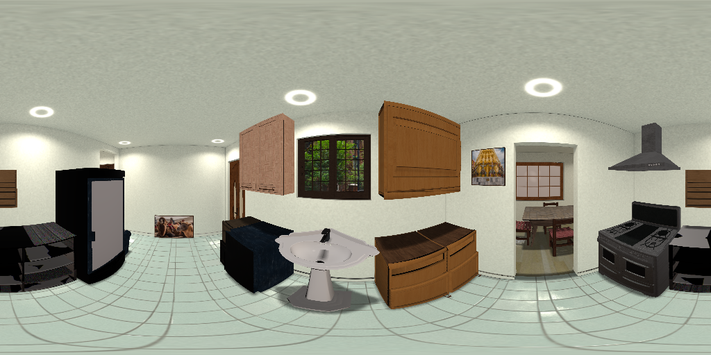
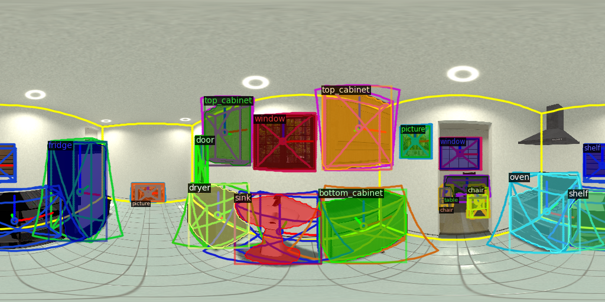
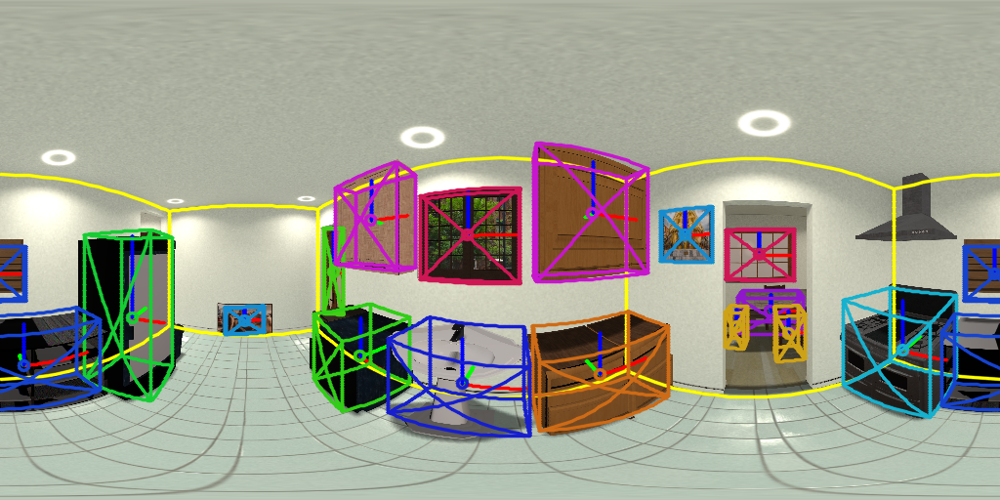
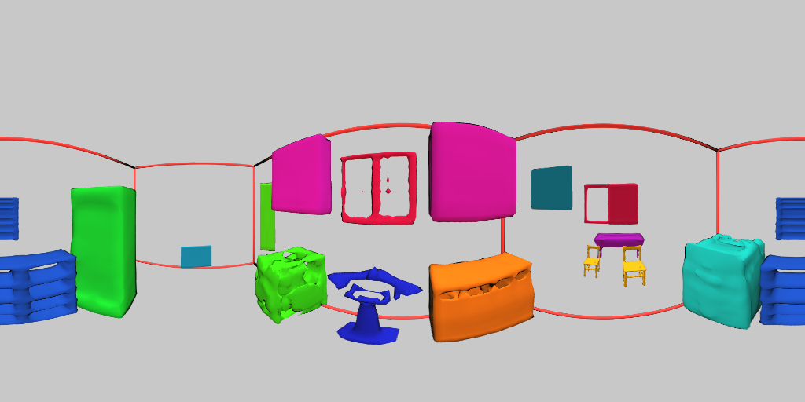

# DeepPanoContext (DPC) [[Project Page (with interactive results)]](https://chengzhag.github.io/publication/dpc/)[[Paper]](https://arxiv.org/abs/2108.10743)[[Video]](https://www.youtube.com/watch?v=mO1EtUHnX4w)

### DeepPanoContext: Panoramic 3D Scene Understanding with Holistic Scene Context Graph and Relation-based Optimization
Cheng Zhang, Zhaopeng Cui, Cai Chen, Shuaicheng Liu, Bing Zeng, Hujun Bao, Yinda Zhang


## Introduction

This repo contains data generation, data preprocessing, training, testing, evaluation, visualization code of our ICCV 2021 paper.

## Install

Install necessary tools and create conda environment (needs to install anaconda if not available): 
```
sudo apt install xvfb ninja-build freeglut3-dev libglew-dev meshlab
conda env create -f environment.yaml
conda activate Pano3D
python -m pip install detectron2 -f https://dl.fbaipublicfiles.com/detectron2/wheels/cu101/torch1.7/index.html
python project.py build
```
- When running ```python project.py build```, the script will run ```external/build_gaps.sh``` which requires password for sudo privilege for ```apt-get install```.
Please make sure you are running with a user with sudo privilege.
If not, please reach your administrator for installation of [these libraries](https://github.com/chengzhag/Implicit3DUnderstanding/blob/af2964f074d941cd990cff81a9b5f75489586ed2/external/build_gaps.sh#L37) and comment out the corresponding lines then run ```python project.py build```.
- If you encounter ```/usr/bin/ld: cannot find -lGL``` problem when building GAPS, please follow [this issue](https://github.com/chengzhag/Implicit3DUnderstanding/issues/10#issuecomment-876727536).

Since the dataloader loads large number of variables,
before training, please follow [this](https://stackoverflow.com/questions/39537731/errno-24-too-many-open-files-but-i-am-not-opening-files) to raise the open file descriptor limits of your system.
For example, to permanently change the setting, edit ```/etc/security/limits.conf``` with a text editor and add the following lines:
```
*         hard    nofile      500000
*         soft    nofile      500000
root      hard    nofile      500000
root      soft    nofile      500000
```

## Demo

Download the [pretrained checkpoints](https://stduestceducn-my.sharepoint.com/:u:/g/personal/2015010912010_std_uestc_edu_cn/EUbGsq_V5K9Ai7U-MpMBcbsBEgPvl3VtVpsVv1IfJDlY7g?e=YPMQNU) 
of detector, layout estimation network, and other modules.
Then unzip the folder ```out``` into the root directory of current project.
Since the given checkpoints are trained with current version of our code, which is a refactored version, the results are slightly better than those reported in our paper.

Please run the following command to predict on the given example in ```demo/input``` with our full model:

```shell
CUDA_VISIBLE_DEVICES=0 WANDB_MODE=dryrun python main.py configs/pano3d_igibson.yaml --model.scene_gcn.relation_adjust True --mode test
```
    
Or run without relation optimization:

```shell
CUDA_VISIBLE_DEVICES=0 WANDB_MODE=dryrun python main.py configs/pano3d_igibson.yaml --mode test
```

The results will be saved to ```out/pano3d/<demo_id>```.
If nothing goes wrong, you should get the following results:

  <br>
 

## Data preparation

Our data is rendered with [iGibson](http://svl.stanford.edu/igibson/). 
Here, we follow their [Installation](http://svl.stanford.edu/igibson/docs/installation.html) guide to download iGibson dataset, then render and preprocess the data with our code.

1. Download iGibson dataset with:
    ```shell
    python -m gibson2.utils.assets_utils --download_ig_dataset
    ```

2. Render panorama with:
    ```shell
    python -m utils.render_igibson_scenes --renders 10 --random_yaw --random_obj --horizon_lo --world_lo
    ```
   The rendered dataset should be in ```data/igibson/```.
   
3. Make models watertight and render/crop single object image:
    ```shell
    python -m utils.preprocess_igibson_obj --skip_mgn
    ```
   The processed results should be in ```data/igibson_obj/```.
   
4. (Optional) Before proceeding to the training steps, you could visualize dataset ground-truth of ```data/igibson/``` with:
    ```shell
    python -m utils.visualize_igibson
    ```
   Results ('visual.png' and 'render.png') should be saved to folder of each camera like ```data/igibson/Pomaria_0_int/00007```.
   

## Training and Testing

### Preparation

1. We use the pretrained weights of [Implicit3DUnderstanding](https://github.com/chengzhag/Implicit3DUnderstanding) for fine-tuning Bdb3d Estimation Network (BEN) and LIEN+LDIF. Please download the [pretrained checkpoint](https://stduestceducn-my.sharepoint.com/:u:/g/personal/2015010912010_std_uestc_edu_cn/Efs2Tqlkk_pIhy16ud20m5sBMkbkWJEuspiLjdF4G2jOzA?e=sxnswk)
and unzip it into ```out/total3d/20110611514267/```.

2. We use [wandb](https://wandb.ai/) for logging and visualizing experiments. You can follow their [quickstart guide](https://docs.wandb.ai/quickstart) to sign up for a free account and login on your machine with ```wandb login```. The training and testing results will be uploaded to your project "deeppanocontext".

3. Hint: The <XXX_id> in the commands bellow needs to be replaced with the XXX_id trained in the previous steps.

4. Hint: In the steps bellow, when training or testing with main.py, you can override yaml configurations with command line parameter:
    ```shell
    CUDA_VISIBLE_DEVICES=0 python main.py configs/layout_estimation_igibson.yaml --train.epochs 100
    ```
    This might be helpful when debugging or tuning hyper-parameters.

### First Stage
 
#### 2D Detector

Please follow Demo section to download weights for detector before we release full fine-tuning code for detector.

#### Layout Estimation

Train layout estimation network (HorizonNet) with:
```shell
CUDA_VISIBLE_DEVICES=0 python main.py configs/layout_estimation_igibson.yaml
```
The checkpoint and visualization results will be saved to ```out/layout_estimation/<layout_estimation_id>/model_best.pth```
   
#### Save First Stage Outputs

1. Save predictions of 2D detector and LEN as dateset for stage 2 training:
    ```shell
    CUDA_VISIBLE_DEVICES=0 WANDB_MODE=dryrun python main.py configs/first_stage_igibson.yaml --mode qtest --weight out/layout_estimation/<layout_estimation_id>/model_best.pth
    ```
   The first stage outputs should be saved to ```data/igibson_stage1```
   
2. (Optional) Visualize stage 1 dataset with:
    ```shell
    python -m utils.visualize_igibson --dataset data/igibson_stage1 --skip_render
    ```

### Second Stage

#### Object Reconstruction

Train object reconstruction network (LIEN+LDIF) with:
```shell
CUDA_VISIBLE_DEVICES=0 python main.py configs/ldif_igibson.yaml
```
The checkpoint and visualization results will be saved to ```out/ldif/<ldif_id>```.
   
#### Bdb3D Estimation

Train bdb3d estimation network (BEN) with:
```shell
CUDA_VISIBLE_DEVICES=0 python main.py configs/bdb3d_estimation_igibson.yaml
```
The checkpoint and visualization results will be saved to ```out/bdb3d_estimation/<bdb3d_estimation_id>```.

#### Relation SGCN
   
1. Train Relation SGCN without relation branch:
    ```shell
    CUDA_VISIBLE_DEVICES=0 python main.py configs/relation_scene_gcn_igibson.yaml --model.scene_gcn.output_relation False --model.scene_gcn.loss BaseLoss --weight out/bdb3d_estimation/<bdb3d_estimation_id>/model_best.pth out/ldif/<ldif_id>/model_best.pth
    ```
   The checkpoint and visualization results will be saved to ```out/relation_scene_gcn/<relation_sgcn_wo_rel_id>```.
   
2. Train Relation SGCN with relation branch:
    ```shell
    CUDA_VISIBLE_DEVICES=0 python main.py configs/relation_scene_gcn_igibson.yaml --weight out/relation_scene_gcn/<relation_sgcn_wo_rel_id>/model_best.pth --train.epochs 20 
    ```
   The checkpoint and visualization results will be saved to ```out/relation_scene_gcn/<relation_sgcn_id>```.
 
3. Fine-tune Relation SGCN end-to-end with relation optimization:
    ```shell
    CUDA_VISIBLE_DEVICES=0 python main.py configs/relation_scene_gcn_igibson.yaml --weight out/relation_scene_gcn/<relation_sgcn_id>/model_best.pth --model.scene_gcn.relation_adjust True --train.batch_size 1 --val.batch_size 1 --device.num_workers 2 --train.freeze shape_encoder shape_decoder --model.scene_gcn.loss_weights.bdb3d_proj 1.0 --model.scene_gcn.optimize_steps 20 --train.epochs 10
    ```
   The checkpoint and visualization results will be saved to ```out/relation_scene_gcn/<relation_sgcn_ro_id>```.

### Test Full Model

Run:

```shell
CUDA_VISIBLE_DEVICES=0 python main.py configs/relation_scene_gcn_igibson.yaml --weight out/relation_scene_gcn/<relation_sgcn_ro_id>/model_best.pth --log.path out/relation_scene_gcn --resume False --finetune True --model.scene_gcn.relation_adjust True --mode qtest --model.scene_gcn.optimize_steps 100
```

The visualization results will be saved to ```out/relation_scene_gcn/<relation_sgcn_ro_test_id>```.

## Citation

If you find our work and code helpful, please consider cite:
```
@inproceedings{zhang2021deeppanocontext,
  title={DeepPanoContext: Panoramic 3D Scene Understanding With Holistic Scene Context Graph and Relation-Based Optimization},
  author={Zhang, Cheng and Cui, Zhaopeng and Chen, Cai and Liu, Shuaicheng and Zeng, Bing and Bao, Hujun and Zhang, Yinda},
  booktitle={Proceedings of the IEEE/CVF International Conference on Computer Vision},
  pages={12632--12641},
  year={2021}
}

@InProceedings{Zhang_2021_CVPR,
    author    = {Zhang, Cheng and Cui, Zhaopeng and Zhang, Yinda and Zeng, Bing and Pollefeys, Marc and Liu, Shuaicheng},
    title     = {Holistic 3D Scene Understanding From a Single Image With Implicit Representation},
    booktitle = {Proceedings of the IEEE/CVF Conference on Computer Vision and Pattern Recognition (CVPR)},
    month     = {June},
    year      = {2021},
    pages     = {8833-8842}
}
```

We thank the following great works:
- [Total3DUnderstanding](https://github.com/yinyunie/Total3DUnderstanding) for their well-structured code. We construct our network based on their well-structured code.
- [Coop](https://github.com/thusiyuan/cooperative_scene_parsing) for their dataset. We used their processed dataset with 2D detector prediction.
- [LDIF](https://github.com/google/ldif) for their novel representation method. We ported their LDIF decoder from Tensorflow to PyTorch.
- [Graph R-CNN](https://github.com/jwyang/graph-rcnn.pytorch/blob/master/README.md) for their scene graph design. We adopted their GCN implemention to construct our SGCN.
- [Occupancy Networks](https://github.com/autonomousvision/occupancy_networks) for their modified version of [mesh-fusion](https://github.com/davidstutz/mesh-fusion) pipeline.

If you find them helpful, please cite:
```
@InProceedings{Nie_2020_CVPR,
author = {Nie, Yinyu and Han, Xiaoguang and Guo, Shihui and Zheng, Yujian and Chang, Jian and Zhang, Jian Jun},
title = {Total3DUnderstanding: Joint Layout, Object Pose and Mesh Reconstruction for Indoor Scenes From a Single Image},
booktitle = {IEEE/CVF Conference on Computer Vision and Pattern Recognition (CVPR)},
month = {June},
year = {2020}
}
@inproceedings{huang2018cooperative,
  title={Cooperative Holistic Scene Understanding: Unifying 3D Object, Layout, and Camera Pose Estimation},
  author={Huang, Siyuan and Qi, Siyuan and Xiao, Yinxue and Zhu, Yixin and Wu, Ying Nian and Zhu, Song-Chun},
  booktitle={Advances in Neural Information Processing Systems},
  pages={206--217},
  year={2018}
}	
@inproceedings{genova2020local,
    title={Local Deep Implicit Functions for 3D Shape},
    author={Genova, Kyle and Cole, Forrester and Sud, Avneesh and Sarna, Aaron and Funkhouser, Thomas},
    booktitle={Proceedings of the IEEE/CVF Conference on Computer Vision and Pattern Recognition},
    pages={4857--4866},
    year={2020}
}
@inproceedings{yang2018graph,
    title={Graph r-cnn for scene graph generation},
    author={Yang, Jianwei and Lu, Jiasen and Lee, Stefan and Batra, Dhruv and Parikh, Devi},
    booktitle={Proceedings of the European Conference on Computer Vision (ECCV)},
    pages={670--685},
    year={2018}
}
@inproceedings{mescheder2019occupancy,
  title={Occupancy networks: Learning 3d reconstruction in function space},
  author={Mescheder, Lars and Oechsle, Michael and Niemeyer, Michael and Nowozin, Sebastian and Geiger, Andreas},
  booktitle={Proceedings of the IEEE Conference on Computer Vision and Pattern Recognition},
  pages={4460--4470},
  year={2019}
}
```


